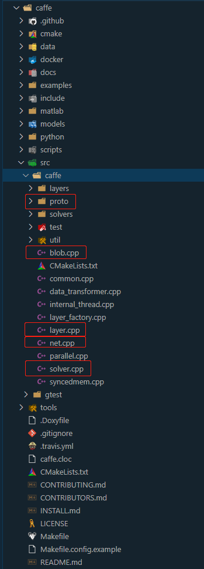
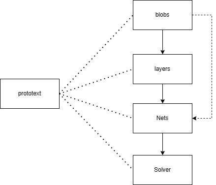
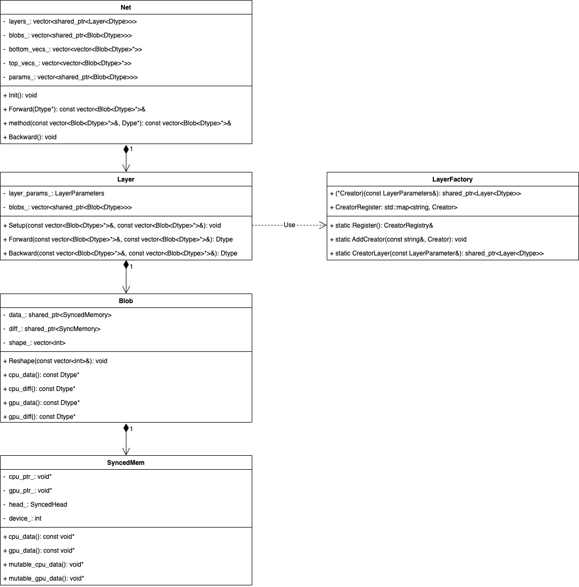
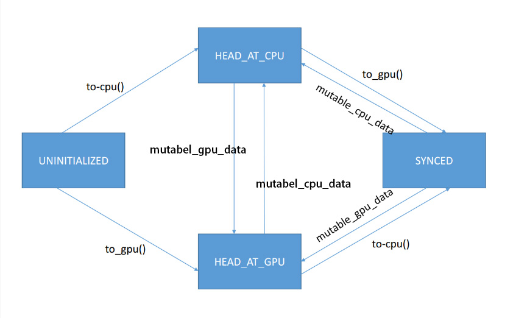

# Caffe 源码

[TOC]

## 总体架构



caffe中有五个核心组件：

- proto：数据交换格式，类似XML，来自于google的protobuf；
- blob：实际上就是现在深度学习框架中的Tensor，NCHW的四维矩阵；
- layer：网络层，即具体的算子，layers文件夹中是算子的具体cpu和gpu的kernel实现，每个layer都有一组input blobs和一组output blobs；
- net：整体网络，记录了一个网络中的所有layers和每个layer的输入和输出的blobs；
- solver：optimizer，solvers文件夹中；

组件逻辑图如下：



prototext中定义了网络的整体结构和layer之间的关系，以及layer的所有参数和属性。

类图如下：



## Blob

Blob是caffe中的数据类，类似现代深度学习框架中的Tensor类，根据类图我们可以看到，由Blob、SyncedMemory一起来进行数据管理。

Blob只是一个wrapper类，真正的数据指针和数据的D2H、H2D操作都是通过SyncedMemory类来管理和实现的。

我们通过头文件来学习Blob类中的具体内容，只保留头文件中的核心部分。

```cpp
namespace caffe {
template <typename Dtype>
class Blob {
 public:
  Blob(): data_(), diff_(), count_(0), capacity_(0) {}

  // 实例化需要设置NCHW
  explicit Blob(const int num, const int channels, const int height, const int width);
  explicit Blob(const vector<int>& shape);

  // 用于数据访问的接口，cpu_data()、gpu_data()、cpu_diff()、gpu_diff()直接返回SyncedMemory中的数据指针Dtype*
  const Dtype* cpu_data() const;
  void set_cpu_data(Dtype* data);
  const int* gpu_shape() const;
  const Dtype* gpu_data() const;
  void set_gpu_data(Dtype* data);
  const Dtype* cpu_diff() const;
  const Dtype* gpu_diff() const;

  // 同上，返回SyncedMemory中记录的数据指针，mutable这里含义就是内容是否可以修改，相当于对于用户的约束
  Dtype* mutable_cpu_data();
  Dtype* mutable_gpu_data();
  Dtype* mutable_cpu_diff();
  Dtype* mutable_gpu_diff();
  void Update();

  void FromProto(const BlobProto& proto, bool reshape = true);
  void ToProto(BlobProto* proto, bool write_diff = false) const;

 protected:
  shared_ptr<SyncedMemory> data_;  // 记录数据的syncedmemory对象
  shared_ptr<SyncedMemory> diff_;  // 记录梯度的syncedmemory对象
  shared_ptr<SyncedMemory> shape_data_;
  vector<int> shape_;  // <N, C, H, W>数据
  int count_;  // N * C * H *　W
  int capacity_;
};
}
```

SyncedMemory类是数据的实际管理者。对于同一份数据，会有在cpu上的版本和在gpu上的版本，syncedhead表明了当前的数据状态，这里设计了一个完整的状态机

- UNINITIALIZED：当前数据对象没有进行过初始化，没有任何已分配的内存或者显存空间；
- HEAD_AT_CPU：目前在内存上的数据内容是最新的，不对显存上的数据内容做任何保证；
- HEAD_AT_GPU：目前在显存上的数据内容是最新的，不对内存上的数据内容做任何保证；
- SYNCED：内存和显存上的数据是一致的；

状态机的变化具体如下：



```cpp
// 负责caffe底层的数据的内存管理
class SyncedMemory {
 public:
  SyncedMemory();
  explicit SyncedMemory(size_t size);
  ~SyncedMemory();
  const void* cpu_data();  // 获取cpu上的data地址
  void set_cpu_data(void* data);  // 将数据设置到一块新的cpu内存区域中，将原本的地址释放
  const void* gpu_data();  // 获取gpu上的data地址
  void set_gpu_data(void* data);  // 将数据设置到一块新的gpu内存区域中，将原本的地址释放
  void* mutable_cpu_data();
  void* mutable_gpu_data();
  enum SyncedHead { UNINITIALIZED, HEAD_AT_CPU, HEAD_AT_GPU, SYNCED };  // 数据同步状态，本类中操作数据的方法会根据synchead来进行逻辑判断
  SyncedHead head() const { return head_; }
  size_t size() const { return size_; }

#ifndef CPU_ONLY
  void async_gpu_push(const cudaStream_t& stream);
#endif

 private:
  void check_device();

  void to_cpu();
  void to_gpu();
  void* cpu_ptr_;  // cpu内存地址，可以由对象自己分配，也可以外部指定
  void* gpu_ptr_;  // gpu内存地址，可以由对象自己分配，也可以外部指定
  size_t size_;  // 数据大小
  SyncedHead head_;  // 数据同步状态
  bool own_cpu_data_;  // 指示是否由对象内部调用CaffeMoallocHost分配的内存
  bool cpu_malloc_use_cuda_;  // 指示是否使用cudaMallocHost分配pinned memory
  bool own_gpu_data_;  // 指示是否由对象内部调用cudaMalloc分配的显存
  int device_;
  DISABLE_COPY_AND_ASSIGN(SyncedMemory);
};  // class SyncedMemory
```

接下来关注一下重点的函数的实现，因为Blob类是SyncedMemory类的一个wrapper，所以我们重点关注SyncedMemory的函数，也就是上面自动状态机的几个函数和用于内存显存分配的函数。


## Layer

## Net

## Solver