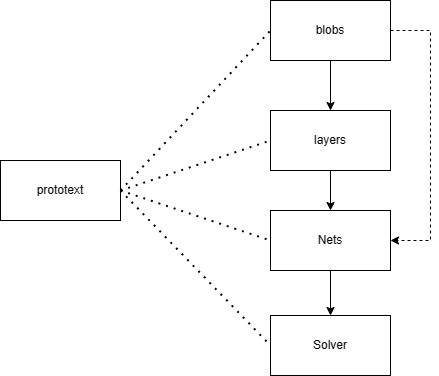

# Caffe Notes

Caffe源码学习笔记。

虽然Caffe已经是非常古老的框架了，但可从中学习到怎么样从一个网络定义变成一个实际的计算图。

在开发一个迷你的计算图执行引擎时，caffe是一个很好的参考，它的组织结构相比Pytorch、Tensorflow等框架足够简洁、清晰，很适合入门框架开发者学习。

同时，它有足够充分的基础算子，可以帮助我们迅速窥探到OP的内在，包括如何使用cudnn、cublas等高层库、如何手写OP等等。

## Abstract

Caffe的核心组件包含五个部分：blobs、layers、nets、solver，以及protobuf。学习过程首先围绕这五个部分的定义和实现展开，再从运行时来看推理和训练过程，以及经典算子的实现。

## File Structure

- caffe：源码注释;
- notes：笔记;

## Todo Progress

- [x] 0. 总体架构
- [x] 1. Blob、SyncedMemory分析
- [x] 2. Layer分析
- [ ] 3. Net分析
- [ ] 4. Solver分析
- [ ] 5. Proto分析
- [ ] 6. 从头到尾的推理过程
- [ ] 7. 从头到尾的训练过程
- [ ] 8. 算子实现

---

如果发现错误，请及时提出Issue。
