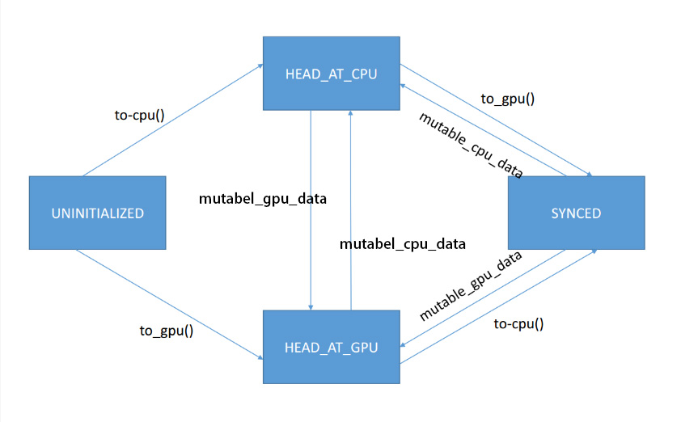

# Blob

[TOC]

## Blob

Blob是caffe中的数据类，类似现代深度学习框架中的Tensor类，根据类图我们可以看到，由Blob、SyncedMemory一起来进行数据管理。

Blob只是一个wrapper类，真正的数据指针和数据的D2H、H2D操作都是通过SyncedMemory类来管理和实现的。

我们通过头文件来学习Blob类中的具体内容，只保留头文件中的核心部分。

```cpp
namespace caffe {
template <typename Dtype>
class Blob {
 public:
  Blob(): data_(), diff_(), count_(0), capacity_(0) {}

  // 实例化需要设置NCHW
  explicit Blob(const int num, const int channels, const int height, const int width);
  explicit Blob(const vector<int>& shape);

  // 用于数据访问的接口，cpu_data()、gpu_data()、cpu_diff()、gpu_diff()直接返回SyncedMemory中的数据指针Dtype*，因为是const pointer，所以不能指向新的对象。
  const Dtype* cpu_data() const;
  void set_cpu_data(Dtype* data);
  const int* gpu_shape() const;
  const Dtype* gpu_data() const;
  void set_gpu_data(Dtype* data);
  const Dtype* cpu_diff() const;
  const Dtype* gpu_diff() const;

  // 同上，返回SyncedMemory中记录的数据指针，mutable这里含义就是内容是否可以修改，相当于对于用户的约束，因此不加const约束
  Dtype* mutable_cpu_data();
  Dtype* mutable_gpu_data();
  Dtype* mutable_cpu_diff();
  Dtype* mutable_gpu_diff();

  void Update();

  void FromProto(const BlobProto& proto, bool reshape = true);
  void ToProto(BlobProto* proto, bool write_diff = false) const;

 protected:
  shared_ptr<SyncedMemory> data_;  // 记录数据的syncedmemory对象
  shared_ptr<SyncedMemory> diff_;  // 记录梯度的syncedmemory对象
  shared_ptr<SyncedMemory> shape_data_;  // 使用SyncedMemory记录N、C、H、W
  vector<int> shape_;  // <N, C, H, W>
  int count_;  // N * C * H *　W，数据量
  int capacity_;  // 开辟的内存、显存的存储能力，也就是实际malloc的空间大小，理论上要大于等于count_数据量
};
}
```

## SyncedMemory

SyncedMemory类是数据的实际管理者。对于同一份数据，会有在cpu上的版本和在gpu上的版本，syncedhead表明了当前的数据状态，这里设计了一个完整的状态机

- UNINITIALIZED：当前数据对象没有进行过初始化，没有任何已分配的内存或者显存空间；
- HEAD_AT_CPU：目前在内存上的数据内容是最新的，不对显存上的数据内容做任何保证；
- HEAD_AT_GPU：目前在显存上的数据内容是最新的，不对内存上的数据内容做任何保证；
- SYNCED：内存和显存上的数据是一致的；

状态机的变化具体如下：



```cpp
// 负责caffe底层的数据的内存管理
class SyncedMemory {
 public:
  SyncedMemory();
  explicit SyncedMemory(size_t size);
  ~SyncedMemory();
  const void* cpu_data();  // 获取cpu上的data地址
  void set_cpu_data(void* data);  // 将数据设置到一块新的cpu内存区域中，将原本的地址释放
  const void* gpu_data();  // 获取gpu上的data地址
  void set_gpu_data(void* data);  // 将数据设置到一块新的gpu内存区域中，将原本的地址释放
  void* mutable_cpu_data();
  void* mutable_gpu_data();
  enum SyncedHead { UNINITIALIZED, HEAD_AT_CPU, HEAD_AT_GPU, SYNCED };  // 数据同步状态，本类中操作数据的方法会根据synchead来进行逻辑判断
  SyncedHead head() const { return head_; }
  size_t size() const { return size_; }

#ifndef CPU_ONLY
  void async_gpu_push(const cudaStream_t& stream);
#endif

 private:
  void check_device();

  void to_cpu();
  void to_gpu();
  void* cpu_ptr_;  // cpu内存地址，可以由对象自己分配，也可以外部指定
  void* gpu_ptr_;  // gpu内存地址，可以由对象自己分配，也可以外部指定
  size_t size_;  // 数据大小
  SyncedHead head_;  // 数据同步状态
  bool own_cpu_data_;  // 指示是否由对象内部调用CaffeMoallocHost分配的内存
  bool cpu_malloc_use_cuda_;  // 指示是否使用cudaMallocHost分配pinned memory
  bool own_gpu_data_;  // 指示是否由对象内部调用cudaMalloc分配的显存
  int device_;
  DISABLE_COPY_AND_ASSIGN(SyncedMemory);
};  // class SyncedMemory
```

## Implementation

### SyncedMemory

接下来关注一下重点的函数的实现，因为Blob类是SyncedMemory类的一个wrapper，所以我们重点关注SyncedMemory的函数，也就是上面自动状态机的几个函数和用于内存显存分配的函数。

#### SyncedMemory构造和析构

SyncedMemory构造时head初始化为UNINITIALIZED，指示当前没有任何的数据并且没有分配过任何的显存、内存空间。如果要使用gpu，实例化时还会获取gpu device号。

```cpp
SyncedMemory::SyncedMemory(size_t size)
  : cpu_ptr_(NULL), gpu_ptr_(NULL), size_(size), head_(UNINITIALIZED),
    own_cpu_data_(false), cpu_malloc_use_cuda_(false), own_gpu_data_(false) {
#ifndef CPU_ONLY
#ifdef DEBUG
  CUDA_CHECK(cudaGetDevice(&device_));
#endif
#endif
}
```

析构时自然就是要释放分配的内存、显存，显存释放直接嗲用cudaFree，内存释放使用了Caffe封装的CaffeFreeHost方法。

```cpp
SyncedMemory::~SyncedMemory() {
  check_device();
  if (cpu_ptr_ && own_cpu_data_) {
    CaffeFreeHost(cpu_ptr_, cpu_malloc_use_cuda_);
  }

#ifndef CPU_ONLY
  if (gpu_ptr_ && own_gpu_data_) {
    CUDA_CHECK(cudaFree(gpu_ptr_));
  }
#endif  // CPU_ONLY
}
```

#### CaffeMalloc/FreeHost

Caffe封装分配和释放内存、显存这一层其实也比较朴素，只是为了对外透明计算平台差异，这种统一的封装还是做异构支持比较常见的方式，对用户屏蔽不同的平台，只暴露指针。

cudaMallocHost分配的是pin memory。和cudaMalloc做区分。

```cpp
inline void CaffeMallocHost(void** ptr, size_t size, bool* use_cuda) {
#ifndef CPU_ONLY
  if (Caffe::mode() == Caffe::GPU) {
    CUDA_CHECK(cudaMallocHost(ptr, size));
    *use_cuda = true;
    return;
  }
#endif
#ifdef USE_MKL
  *ptr = mkl_malloc(size ? size:1, 64);
#else
  *ptr = malloc(size);
#endif
  *use_cuda = false;
  CHECK(*ptr) << "host allocation of size " << size << " failed";
}

inline void CaffeFreeHost(void* ptr, bool use_cuda) {
#ifndef CPU_ONLY
  if (use_cuda) {
    CUDA_CHECK(cudaFreeHost(ptr));
    return;
  }
#endif
#ifdef USE_MKL
  mkl_free(ptr);
#else
  free(ptr);
#endif
}
```

#### CPU

to_cpu和mutable_cpu_data是状态变为cpu的关键方法。

对于to_cpu，有两个状态变化路径：

- UNINTIALIZED -> malloc() -> memset() -> HEAD_AT_GPU、own_cpu_data
- HEAD_AT_GPU
  - HEAD_AT_GPU -> malloc() -> cudaMemcpyDtoH() -> HEAD_AT_GPU、own_cpu_data
  - HEAD_AT_GPU -> cudaMemcpyDtoH() -> SYNCED

```cpp
inline void SyncedMemory::to_cpu() {
  check_device();
  switch (head_) {
  case UNINITIALIZED:  // 数据没有初始化
    CaffeMallocHost(&cpu_ptr_, size_, &cpu_malloc_use_cuda_);
    caffe_memset(size_, 0, cpu_ptr_);
    head_ = HEAD_AT_CPU;
    own_cpu_data_ = true;  // 由CaffeMalocHost自己开辟的内存，则设置为true
    break;
  case HEAD_AT_GPU:  // 数据在显存上
#ifndef CPU_ONLY
    if (cpu_ptr_ == NULL) {  // 没有分配内存地址时先进行分配
      CaffeMallocHost(&cpu_ptr_, size_, &cpu_malloc_use_cuda_);
      own_cpu_data_ = true;
    }
    caffe_gpu_memcpy(size_, gpu_ptr_, cpu_ptr_);  // 当数据在显存上时，从显存memcpy到内存
    head_ = SYNCED;  // 因为此时cpu和gpu上的数据内容时一致的，所以状态是SYNCED
#else
    NO_GPU;
#endif
    break;
  case HEAD_AT_CPU:
  case SYNCED:
    break;
  }
}
```

对于mutable_cpu_data，也有两个路径，不过都是使用to_cpu来实现实际的内存空间申请和数据拷贝，也就是说，虽然该方法的命名方式虽然只是形容词＋名词的结构，但是语义上还是有拷贝的动作，且返回的指针也是可以修改指向的。

- SYNCED -> mutable_cpu_data -> HEAD_AT_CPU
- HEAD_AT_GPU -> mutable_cpu_data -> HEAD_AT_CPU

```cpp
void* SyncedMemory::mutable_cpu_data() {  // 非const
  check_device();
  to_cpu();
  head_ = HEAD_AT_CPU;
  return cpu_ptr_;
}
```

#### GPU

和上面类似，to_gpu和mutable_gpu_data是状态变为gpu的关键方法。

- UNINITIALIZED -> cudaMalloc() -> memset() -> HEAD_AT_GPU、own_gpu_data
- HEAD_AT_CPU
  - HEAD_AT_CPU -> cudaMalloc() -> memcpy() -> HEAD_AT_GPU、own_gpu_data
  - HEAD_AT_CPU -> memcpy() -> SYNCED

```cpp
inline void SyncedMemory::to_gpu() {
  check_device();
#ifndef CPU_ONLY
  switch (head_) {
  case UNINITIALIZED:  // 数据没有初始化
    CUDA_CHECK(cudaMalloc(&gpu_ptr_, size_));  // 分配显存空间
    caffe_gpu_memset(size_, 0, gpu_ptr_);
    head_ = HEAD_AT_GPU;
    own_gpu_data_ = true;
    break;
  case HEAD_AT_CPU:
    if (gpu_ptr_ == NULL) {  // 没有gpu指针时分配显存空间
      CUDA_CHECK(cudaMalloc(&gpu_ptr_, size_));
      own_gpu_data_ = true;
    }
    caffe_gpu_memcpy(size_, cpu_ptr_, gpu_ptr_);  // 数据拷贝
    head_ = SYNCED;  // 因为此时cpu和gpu上的数据内容时一致的，所以状态是SYNCED
    break;
  case HEAD_AT_GPU:
  case SYNCED:
    break;
  }
#else
  NO_GPU;
#endif
}
```

```cpp
void* SyncedMemory::mutable_gpu_data() {
  check_device();
#ifndef CPU_ONLY
  to_gpu();
  head_ = HEAD_AT_GPU;
  return gpu_ptr_;
#else
  NO_GPU;
  return NULL;
#endif
}
```

从上面的代码中可以看到，SYNCED状态的逻辑，gpu->cpu、cpu->gpu后，两侧的数据内容是完全一致的，那么状态就是SYNCED的。对于mutable方法，因为返回的指针不是const的，所以指向的内存地址是可以被改变的，这个时候head是被标记为HEAD_AT_GPU、HEAD_AT_CPU，同时因为mutable方法不只是为了拷贝同步数据，所以状态最终不是SYNCED。

#### 更新数据指针

因为SyncedMemory做实际数据和内存、显存的管理，所以提供一个设置数据指针的方法也是必须的。caffe中提供了一个cpu的和一个gpu的方法。

这里的数据设置指的不是我们在原有的地址空间中写入数据，而是把我们的地址设置到SyncedMemory对象中，所以方法内容也很简单，就是设置ptr和其他的成员变量。

```cpp
void SyncedMemory::set_cpu_data(void* data) {
  check_device();
  CHECK(data);
  if (own_cpu_data_) {
    CaffeFreeHost(cpu_ptr_, cpu_malloc_use_cuda_);
  }
  cpu_ptr_ = data;
  head_ = HEAD_AT_CPU;
  own_cpu_data_ = false;
}

void SyncedMemory::set_gpu_data(void* data) {
  check_device();
#ifndef CPU_ONLY
  CHECK(data);
  if (own_gpu_data_) {
    CUDA_CHECK(cudaFree(gpu_ptr_));
  }
  gpu_ptr_ = data;
  head_ = HEAD_AT_GPU;
  own_gpu_data_ = false;
#else
  NO_GPU;
#endif
}

```

#### 数据同步

直接封装的rt的memcpy api。

同步

```cpp
void caffe_gpu_memcpy(const size_t N, const void* X, void* Y) {
  if (X != Y) {
    CUDA_CHECK(cudaMemcpy(Y, X, N, cudaMemcpyDefault));  // NOLINT(caffe/alt_fn)
  }
}
```

异步

```cpp
#ifndef CPU_ONLY
void SyncedMemory::async_gpu_push(const cudaStream_t& stream) {
  check_device();
  CHECK(head_ == HEAD_AT_CPU);  // 当前cpu上的数据是最新的，需要同步到gpu上
  if (gpu_ptr_ == NULL) {  // 没有分配显存的时候
    CUDA_CHECK(cudaMalloc(&gpu_ptr_, size_));  // 先分配显存
    own_gpu_data_ = true;
  }
  const cudaMemcpyKind put = cudaMemcpyHostToDevice;
  CUDA_CHECK(cudaMemcpyAsync(gpu_ptr_, cpu_ptr_, size_, put, stream));  // 拷贝数据到gpu上
  // Assume caller will synchronize on the stream before use
  head_ = SYNCED;  // 刚拷贝完，数据是一直的
}
#endif
```

### Blob

上面的实现都是SyncedMemory的内容，虽然blobs只是一个wrapper，但是Blob同样也有许多和shape也就是dimension相关的方法，这些方法虽然本身不复杂，但是却体现了数据存储和数据表达分离的思想，也值得一看。

#### Blob构造和析构

构造函数，从Blob的角色来看，因为是wrapper，不负责存储，那就要负责数据特征的表达了，不然这个wrapper好像也没有其他的作用了，所以这里的参数列表就是数据维度了，n、c、h、w，然后调用Reshape方法进行shape的设置。

```cpp
template <typename Dtype>
Blob<Dtype>::Blob(const int num, const int channels, const int height,
    const int width)
  // capacity_ must be initialized before calling Reshape
  : capacity_(0) {
  Reshape(num, channels, height, width);
}

template <typename Dtype>
Blob<Dtype>::Blob(const vector<int>& shape)
  // capacity_ must be initialized before calling Reshape
  : capacity_(0) {
  Reshape(shape);
}
```

析构函数，因为Blob这个类中这里没有任何堆上内存或者其他长生命周期的对象，SyncedMemory使用shared_ptr，一旦Blob对象析构，shared_ptr自然会释放，并且SyncedMemory没有任何的shared_ptr指向它（也就是没有任何blob wrap它），那么这个SyncedMemory对象也会析构，具体的方法上面也看过了，就是free/cudaFree掉内存、显存。

#### Shape(Dimension)

再具体看下Reshape，这是设置数据维度的一个重要方法，在Blob的构造函数中有调用该方法来初始化shape。根本上就是设置shape_和看当前的SyncedMemory看是不是满足新的shape的数据量需求。

```cpp
template <typename Dtype>
void Blob<Dtype>::Reshape(const vector<int>& shape) {  // n, c, h, w
  CHECK_LE(shape.size(), kMaxBlobAxes);
  count_ = 1;  // 记录数据总量
  shape_.resize(shape.size());
  if (!shape_data_ || shape_data_->size() < shape.size() * sizeof(int)) {
    shape_data_.reset(new SyncedMemory(shape.size() * sizeof(int)));
  }
  int* shape_data = static_cast<int*>(shape_data_->mutable_cpu_data());
  for (int i = 0; i < shape.size(); ++i) {
    CHECK_GE(shape[i], 0);
    if (count_ != 0) {
      CHECK_LE(shape[i], INT_MAX / count_) << "blob size exceeds INT_MAX";
    }
    count_ *= shape[i];  // n * c * h * w
    shape_[i] = shape[i];
    shape_data[i] = shape[i];
  }
  if (count_ > capacity_) {  // 对比当前的实际数据量（count）和开辟的空间的容量（capacity），如果开辟的空间容量不够，就重新开辟一块新的空间，满足实际数据需求，所以需要一个新的SyncedMemory来管理最新的存储。
    capacity_ = count_;
    data_.reset(new SyncedMemory(capacity_ * sizeof(Dtype)));  // 不过SyncedMemory在构造的时候不会立即开辟空间，这个我们在上面看过
    diff_.reset(new SyncedMemory(capacity_ * sizeof(Dtype)));
  }
}
```

#### With Proto

读取磁盘文件中的数据，需要结合Proto来看，日后更新。

---

上面这些就是SyncedMemory和Blob的主要内容，其实暴露给用户的接口就是Blob。而Blob的具体用法，在后面的其他组件中能看到，毕竟Blob不是作为一个元素单独使用，而是Layer、Net中的一个基础成员，和Layer一起构成一个网络。
